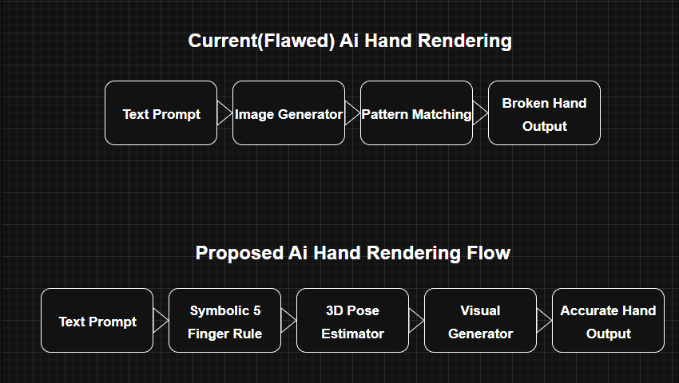

# Why AI Keeps Drawing Broken Hands (and What To Do About It)

This is a structured breakdown of why diffusion-based AI models like DALL·E and Stable Diffusion struggle to render hands accurately — and what a future solution could look like.

---

## ❌ The Problem

AI models often generate images with:
- 6+ fingers
- Merged or floating thumbs
- Inconsistent bone structure

Why? Because they rely on **visual pattern matching**, not **anatomical structure**. They don't "know" that a hand = 5 fingers + joints + pose.

---

## ✅ My Proposal (Summary)

Based on a deep dialogue with GPT-4, I propose a 3-part solution:

1. **Structural Priors**  
   - Add constraints like: “hands default to 5 fingers unless instructed otherwise”

2. **3D-Aware Generation**  
   - Use hand pose + volume to determine which fingers should be visible from the given camera angle

3. **Symbolic + Visual Hybrid Logic**  
   - Merge pattern-based generation with symbolic rules (e.g. skeletal rig, bone count, joint rules)

---
### 🧩 System Flow Diagrams

Here’s a visual comparison between current AI image generation behavior and a proposed improved structure.

### 🧭 Purpose of This Repository

This project explores a common flaw in generative AI — inaccurate human hand rendering — and proposes a structured improvement using pose estimation, visual logic, and symbolic rules.

It’s part of my ongoing learning in AI-human interaction, system design, and interface thinking.

---

**Author:** Krzysztof Grajek  
Computer Science + Design  
Open to collaboration, learning, and contributing to creative tech systems.
